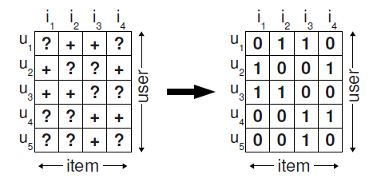
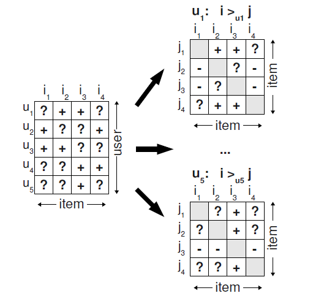

BPR: Bayesian personalized ranking from implicit feedback
===

En este paper se implementa un nuevo algoritmo para recomendación en base a factorización matricial, que genera factores latentes, pero a partir de una nueva función objetivo llamada BPR-Opt que se basa en la utilización de probabilidades bayesianas. Además, a diferencia de los estudios semejantes y técnicas de recomendación user-item, se demuestra la utilización de un enfoque user-(item-item). Esto, en el marco del *feedback implícito* hace referencia a que los _r_ui conocidos como el factor de preferencia del usuario $u$ al item $i$, donde 1 es si es conocido y 0 si no se ha utilizado, se extiende a una representación en dos dimensiones donde para un usuario $u$, existe una comparación entre los items _i_ y _j_, tal como se ve en las siguientes figuras.

---

---

---

Dentro de los aspectos que se señalan en el paper es la explicación de las recomendaciones. Esto generalmente no se puede hacer con los modelos de factores latentes debido a que las características de los usuarios y los items pasan a ser otro tipo de variables. Sin embargo, gracias a la utilización de user-item-item, que son las tripletas _(u, i, j)_ se puede, no solo predecir _r_ui, sino lo que genero esta predicción ruij = rui - ruj. Esto permite mostrar a los usuarios que items fueron escogidos o permitieron la recomendación entregada. A partir de esto es que se podría mezclar, no solo el *implicit feedback* sino que no también, las características de los items para la recomendación (*content-based*), con el objetivo de mejorar la explicación a la recomendación.

Así, encontré que la propuesta presentada en el _paper_ resulta ser clave para la interpretación de las recomendaciones, lo que me pareció muy interesante. 

Ignacio Contreras